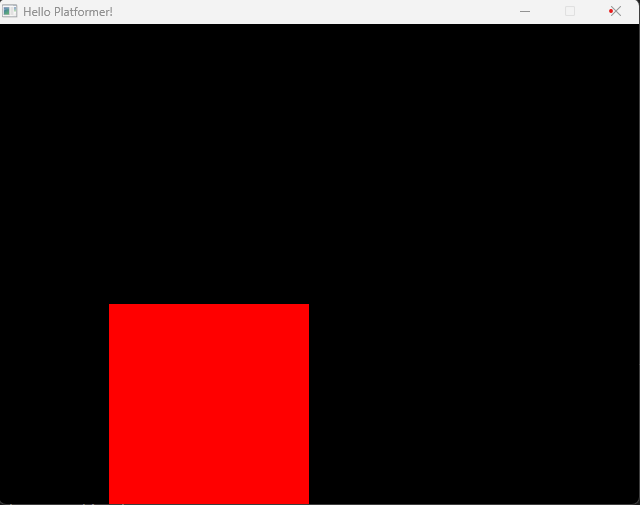

# sdl-win
Building and compiling an example sdl2 project on Windows.

# Install
1. [Download SDL 2.26.4](https://github.com/libsdl-org/SDL/releases)
2. Extract SDL 2.26.4 to `./SDL2`

# Build & Compile
### G++
1. `cp ./SDL2/x86_64-w64-mingw32/bin/SDL2.dll ./SDL2.dll` (ONCE)
2. `g++ main.cpp -Isdl2/x86_64-w64-mingw32/include/SDL2 -Lsdl2/x86_64-w64-mingw32/lib -Wall -lmingw32 -lSDL2main -lSDL2 -o main`

### CMake & Make
1. `cmake -S . -B ./build -G "Unix Makefiles`
2. `cd ./build`
3. `make`

# Result

