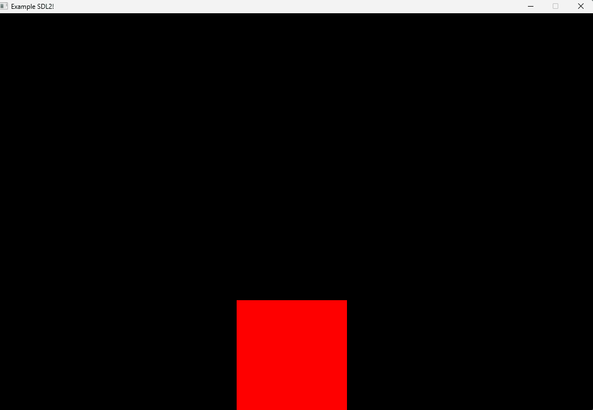

# SDL2 C++ Example
Building and compiling an example SDL2 C++ project with G++ and CMake/Make.

## Windows
---

### Install
*  [Download SDL 2.26.4](https://github.com/libsdl-org/SDL/releases)
*  Extract SDL 2.26.4 to `./SDL2`

### CMake & Make
*  `cmake -S . -B ./build -G "Unix Makefiles"`
*  `cd ./build`
*  `make`
###  G++
*  `cp ./SDL2/x86_64-w64-mingw32/bin/SDL2.dll ./SDL2.dll`
*  `g++ main.cpp -Isdl2/x86_64-w64-mingw32/include/ -Lsdl2/x86_64-w64-mingw32/lib -Wall -lmingw32 -lSDL2main -lSDL2 -o main`

## Linux 
---

### Install
* `sudo apt-get install libsdl2-dev`

### CMake & Make
*  `cmake -S . -B ./build -G "Unix Makefiles"`
*  `cd ./build`
*  `make`

### G++
*  `g++ main.cpp -Ilibsdl2 -Llibsdl2 -Wall -lSDL2main -lSDL2 -o main`

